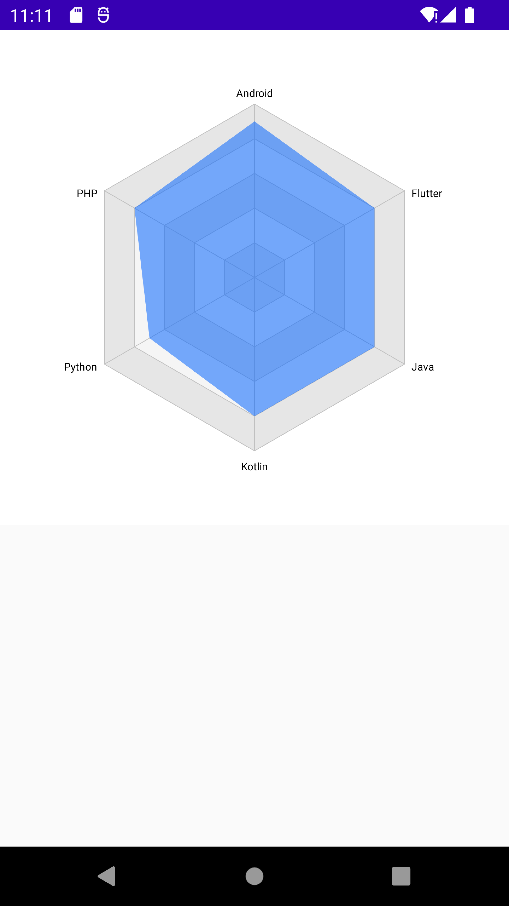

# jetpack compose 实现的雷达图



## 使用
```
        // 设置数据
        val chartData = RadarChartData(
            pointList = listOf(
                Point("Android", 0.9f),
                Point("Flutter", 0.8f),
                Point("Java", 0.8f),
                Point("Kotlin", 0.8f),
                Point("Python", 0.7f),
                Point("PHP", 0.8f),
            )
        )
        // 传入数据
        RadarChart(chartData = chartData)
```
